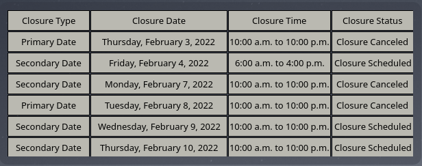

# Boca Chica Plasmoid

This is a KDE Plasmiod that is used to display the most recent Highway 4 Road closures.

And will soon display TFR's

## Installation

Download the code.
Then open the downloaded the code in a terminal

```kpackagetool5 -t Plasma/Applet --install io.Pizzarules668.BocaChicaTx```

Then right click on your decktop, and click add widget. Then search for Boca Chica Tx. Then drag it on to your Desktop where you want it.

## Update
Download the code.
Then open the downloaded the code in a terminal

```kpackagetool5 -t Plasma/Applet --upgrade io.Pizzarules668.BocaChicaTx```

## Screenshots

